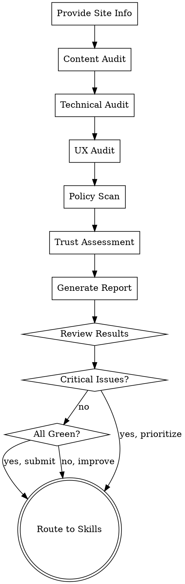

# Google Ads Readiness Assessment

Conduct a comprehensive diagnostic of your website's readiness for Google AdSense approval. Produces a prioritized list of issues and guides you to appropriate remediation skills.

## Quick Start

**Input**: Website URL or local project path
**Output**: Interactive diagnostic report + prioritized issue list + recommended next steps
**Time**: 15-30 minutes for full assessment

## Scoring Mode Contract

This skill is responsible for choosing and declaring the audit scope before results are aggregated.

- Supported score modes: `Core 79`, `Core 79 + Profile`, `Full 105`
- Default mode: `Core 79 + Profile` for one clearly identified primary site type
- Escalate to `Full 105` when the site spans multiple business models or the brief explicitly requires full-scope review
- If only a quick internal triage is requested, `Core 79` is acceptable as long as the report says so explicitly

Every output from this skill should declare:
- `score_mode`
- `primary_site_type`
- `selected_profile_items`
- `triggered_extension_items`
- `evaluated_item_count`

## Workflow

### Step 1: Provide Site Information

Answer initial questions about your site:
- Website URL or local project path
- Primary site type (blog, tool, affiliate, news, e-commerce, forum/community)
- Primary industry/niche
- Content language and target markets
- Current status (planning, pre-submission, rejected, active)

### Step 2: Run Comprehensive Audit

Automatically or semi-automatically assess 5 key dimensions:

1. **Content Integrity** (via `content-audit`) - Is your content original, substantial, and well-structured?
2. **Technical Health** (via `technical-audit`) - Is your infrastructure sound and performant?
3. **User Experience** (via `ux-compliance-audit`) - Is your site accessible and user-friendly?
4. **Policy Compliance** (via `policy-risk-scanner`) - Are you avoiding prohibited content and practices?
5. **Trust & Credibility** (via trust assessment) - Do users trust your site?

### Step 3: Review Diagnostic Report

Receive a detailed report showing:
- Overall readiness score (0-100)
- Per-pillar scores and breakdown
- Critical issues (must fix before submission)
- High-priority issues (fix before submission if possible)
- Medium/Low issues (improve post-approval)
- Estimated time to address each category

### Step 4: Choose Your Path

Based on your diagnostic results:
- **All Green**: Use `resubmission-readiness-check` and submit
- **Some Issues**: Follow improvement guides for each pillar
- **Critical Issues**: Prioritize critical fixes before proceeding
- **Recently Rejected**: Go to `rejection-root-cause-analysis`

## Checklist

1. ✓ Input site information (URL or path)
2. ✓ Content audit analysis
3. ✓ Technical audit analysis
4. ✓ UX compliance check
5. ✓ Policy risk scan
6. ✓ Trust assessment
7. ✓ Generate diagnostic report
8. ✓ Provide remediation recommendations
9. ✓ Export results (JSON + Markdown)
10. ✓ User reviews report and selects next skill

## Process Flow



## Diagnostic Dimensions

### Content Integrity (CI)
**Questions addressed**: Is content original, substantial, valuable, and properly structured?

**Output includes**:
- Content volume analysis (words per page distribution)
- Originality assessment (duplication detection)
- Content depth and usefulness evaluation
- Metadata quality (titles, descriptions)
- Heading structure validation
- Freshness assessment

**Related skills for improvement**: `content-improvement-blueprint`

### Technical Health (TH)
**Questions addressed**: Is infrastructure sound, performant, and secure?

**Output includes**:
- SSL/HTTPS validation
- Performance metrics (LCP, CLS, FID)
- Mobile responsiveness check
- Core Web Vitals assessment
- XML sitemap and robots.txt verification
- Broken link detection
- Third-party script analysis
- CDN and compression status

**Related skills for improvement**: `technical-remediation-guide`

### User Experience (UX)
**Questions addressed**: Is the site accessible, navigable, and ad-friendly?

**Output includes**:
- Navigation structure evaluation
- Content-to-ad ratio analysis
- Intrusive element detection (popups, interstitials)
- Typography and readability check
- Accessibility compliance (WCAG)
- Mobile UX assessment
- Link functionality validation
- Color contrast verification

**Related skills for improvement**: `ux-optimization-roadmap`

### Policy Compliance (PC)
**Questions addressed**: Are you avoiding prohibited content and protecting user data?

**Output includes**:
- Content category risk assessment (adult, gambling, illegal, etc.)
- Deceptive practice detection
- Malware/unwanted software check
- Animal abuse content scan
- Affiliate disclosure verification
- Data protection policy check
- Ad code placement validation
- Regulated content handling (tobacco, gambling, alcohol)

**Related skills for improvement**: `policy-remediation-plan`

### Trust & Disclosure (TD)
**Questions addressed**: Is your site transparent, credible, and properly disclosing relationships?

**Output includes**:
- About page quality assessment
- Author/creator credibility evaluation
- Contact information availability
- Privacy policy completeness
- WHOIS and domain trust indicators
- SSL certificate status and age
- User review presence and authenticity
- Author expertise signals

**Related skills for improvement**: `trust-credibility-strategy`

## Output Formats

### JSON Report
Structured data suitable for programmatic processing:
```json
{
  "assessment_date": "2026-05-03T10:30:00Z",
  "site_url": "https://example.com",
  "score_mode": "Core 79 + Profile",
  "primary_site_type": "blog",
  "selected_profile_items": ["CI15", "CI17", "CI18"],
  "triggered_extension_items": ["UX18"],
  "evaluated_item_count": 83,
  "overall_score": 72,
  "pillars": {
    "content_integrity": {
      "score": 85,
      "status": "good",
      "critical_issues": [],
      "high_issues": [],
      "medium_issues": [...]
    },
    ...
  },
  "next_steps": [...]
}
```

### Markdown Report
Human-readable diagnostic summary with:
- Executive summary (5-point overview)
- Declared score mode and why it was chosen
- Per-pillar breakdown with examples
- Prioritized issue list
- Time estimates for fixes
- Recommended skill sequence

### Interactive Survey
Step-by-step questionnaire covering:
- Site fundamentals
- Content strategy
- Technical setup
- UX considerations
- Policy compliance concerns

## Integration with Other Skills

This skill acts as **orchestrator** and **entry point**:

```
[ads-readiness-assessment] coordinates with:
├─→ [content-audit]
├─→ [technical-audit]
├─→ [ux-compliance-audit]
├─→ [policy-risk-scanner]
├─→ [affiliate-link-compliance]
├─→ [copyright-ip-check]
└─→ [seo-spam-detection]

Then routes user to appropriate improvement skills:
├─→ [content-improvement-blueprint]
├─→ [technical-remediation-guide]
├─→ [ux-optimization-roadmap]
├─→ [policy-remediation-plan]
└─→ [trust-credibility-strategy]

Final verification before submission:
└─→ [resubmission-readiness-check]
```

## Supported Check Modes

### URL Mode
Input a live website URL:
- Automatic crawling and analysis
- Real-time performance testing
- Live SSL verification
- Actual mobile responsiveness check

### Source Mode
Analyze a local project directory:
- Parse HTML/CSS/JS source files
- Analyze content directly from files
- Check configuration files
- Review metadata and schema markup

### Manual Mode
Interactive guided assessment:
- Answer questions about your site
- Manual verification for subjective criteria
- Photo/screenshot uploads for visual review
- Step-by-step walkthrough

## Check Completion

When assessment is complete:

1. **Review Summary**: Scan the overall score and per-pillar breakdown
2. **Identify Blockers**: Note critical issues that prevent submission
3. **Prioritize Work**: See recommended issue fix order
4. **Select Remediation**: Click through to specific improvement skills
5. **Track Progress**: Export results for team coordination

## Common Patterns

### All Green Status
Your site passes all criteria → Go directly to `resubmission-readiness-check` for final verification

### Single Pillar Issues
Only one area needs work → Focus improvements in that single skill

### Multiple Areas Needed
Several pillars have issues → Use provided priority ranking to sequence work

### Already Rejected
Use output as input to `rejection-root-cause-analysis` to map Google's feedback to specific issues

## Tips

- **First Assessment**: Don't try to fix everything at once; focus on critical issues first
- **Time Estimate**: Factor in 1-2 weeks minimum for comprehensive improvements
- **Team Coordination**: Export results to share with your team
- **Track Changes**: Run assessment again after major improvements to see progress
- **Ask Questions**: If you don't understand a finding, each issue links to detailed explanation

---

**Next Skills**:
- Issues found? → Use improvement guides: `content-improvement-blueprint`, `technical-remediation-guide`, etc.
- Want verification? → `resubmission-readiness-check`
- Recently rejected? → `rejection-root-cause-analysis`
- Already approved? → `active-compliance-monitor`
