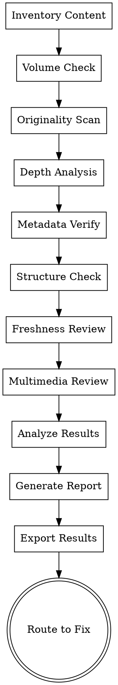

# Content Integrity Audit

Thoroughly evaluate all aspects of your content against Google AdSense Content Integrity standards. Checks for originality, depth, volume, structure, and freshness across your entire site.

## Purpose

Verify that your content meets Content Integrity (CI) criteria from the ARB benchmark:
- Minimum volume and depth
- Original vs. scraped/duplicated content
- Proper metadata (titles, descriptions)
- Heading hierarchy and structure
- Content freshness and updates
- Quality of multimedia content

## Quick Start

**Input**: Website URL or local project source
**Output**: Markdown checklist + violation details + content quality score
**Optional Scripts**: Text extraction, duplication detection, metadata validation
**Time**: 10-20 minutes

## Scoring Mode & Aggregation Contract

This skill contributes CI signals into one of three benchmark scopes:

- `Core 79`: required coverage is CI01-CI14
- `Core 79 + Profile`: required coverage is CI01-CI14 plus any CI extension items selected by the site-type profile or conditional triggers
- `Full 105`: cover CI01-CI18

When exporting structured results, include:
- `score_mode`
- `covered_items`
- `missing_items`
- `selected_profile_items` limited to CI items
- `triggered_extension_items` limited to CI items

## Workflow

### Step 1: Content Inventory

Gather all content for analysis:
- Crawl website or scan project files for HTML/content
- Build content inventory (pages, word counts, types)
- Extract text, headings, and metadata

### Step 2: Run Checks

Execute checks against each CI criterion:

| Check | Maps to | Description |
|-------|---------|-------------|
| Minimum Content Volume | CI01 | Each page ≥300 words original body text |
| Originality Detection | CI02 | No verbatim copy-paste from other sites |
| Content Depth | CI03 | Goes beyond definitions; provides actionable detail |
| Language Support | CI04 | Primary language in Google supported list |
| Content Freshness | CI05 | Key pages updated within 12 months |
| Thin Pages at Scale | CI06 | <10% of indexed pages under 200 words |
| Self-Duplicate Content | CI07 | Long-form text not repeated across multiple pages |
| AI Content Value-Add | CI08 | AI-generated content has unique perspective |
| User-Focused Content | CI09 | Written for humans, not for search engines |
| Media Aggregation | CI10 | Embedded media has original commentary |
| Meta Description | CI11 | Unique, 120-158 characters |
| Title Tag Quality | CI12 | Unique, 50-60 chars, keyword at start |
| Heading Hierarchy | CI13 | Proper H1-H6 structure, one H1 per page |
| Content Structure | CI14 | Uses lists, tables, bullet points effectively |
| Update Frequency | CI15 | Regular updates for evergreen content |
| Content Consistency | CI16 | Same topic consistent across pages |
| Data Freshness | CI17 | Statistical claims cite sources <2 years old |
| Multimedia Quality | CI18 | Videos/audio have transcripts and captions |

If running in `Core 79` mode, CI15-CI18 should be marked as `not_in_scope`, not silently omitted.

### Step 3: Review Violations

Examine violations organized by:
- **Severity**: Critical (blocks approval) vs. High vs. Medium vs. Low
- **Category**: Volume, Originality, Structure, Metadata, Freshness, Multimedia
- **Scope**: How many pages affected
- **Example**: Sample page(s) showing the violation

### Step 4: Generate Report

Produces detailed report showing:
- Overall content quality score (0-100)
- Declared score mode and CI scope used
- Per-criterion compliance
- Violation summary with counts
- Problem pages (highest priority)
- Content statistics (avg length, freshness, etc.)

## Checklist

1. ✓ Select input mode (URL or source path)
2. ✓ Build content inventory
3. ✓ Check minimum volume (CI01)
4. ✓ Check originality (CI02)
5. ✓ Verify content depth (CI03)
6. ✓ Validate language support (CI04)
7. ✓ Assess freshness (CI05)
8. ✓ Check for thin pages (CI06)
9. ✓ Detect self-duplication (CI07)
10. ✓ Evaluate AI content (CI08)
11. ✓ Verify user focus (CI09)
12. ✓ Check media attribution (CI10)
13. ✓ Validate meta descriptions (CI11)
14. ✓ Verify title tags (CI12)
15. ✓ Check heading structure (CI13)
16. ✓ Verify content formatting (CI14)
17. ✓ Check update frequency (CI15)
18. ✓ Verify content consistency (CI16)
19. ✓ Check data freshness (CI17)
20. ✓ Verify multimedia quality (CI18)
21. ✓ Generate comprehensive report
22. ✓ Export to Markdown + JSON
23. ✓ Route to content-improvement-blueprint for fixes

## Process Flow



## Detailed Criteria

### Volume & Originality Checks (CI01-CI02)

**CI01: Minimum Content Volume**
- Each page must have ≥300 words of original body content
- Excludes navigation, sidebars, footers
- Detection: Count prose paragraphs after removing boilerplate

**CI02: Originality**
- Check against common sources (Wikipedia, forums, competitor sites)
- Detect verbatim copy-paste passages
- Tools: Built-in plagiarism checker or external API integration

### Depth & Language (CI03-CI04)

**CI03: Content Depth**
- Content goes beyond dictionary definitions
- Provides actionable insight or unique perspective
- Evaluation: Manual or AI-assisted depth scoring

**CI04: Supported Language**
- Primary language in [Google's language list](https://support.google.com/adsense/answer/10502938)
- Language tag validation

### Freshness Checks (CI05, CI15)

**CI05: Content Freshness**
- High-value pages updated ≤12 months ago
- Examples: How-to guides, reviews, news

**CI15: Update Frequency**
- Evergreen content shows regular updates (quarterly minimum)
- Examples: Tutorials, reference material

### Structure & Format (CI13-CI14)

**CI13: Heading Hierarchy**
- Exactly one H1 per page
- Logical H2-H6 nesting (no skips like H1→H3)
- All headings relevant to content

**CI14: Content Structure**
- Effective use of lists, tables, bullet points
- Proper spacing and formatting
- Readable length paragraphs (not walls of text)

### Metadata Quality (CI11-CI12)

**CI11: Meta Description**
- 120-158 characters (ideal)
- Unique per page
- Accurately describes content

**CI12: Title Tag**
- 50-60 characters (ideal)
- Unique per page
- Primary keyword near start
- Accurate and compelling

### Duplication & Consistency (CI07, CI16)

**CI07: No Self-Duplicate Content**
- Same long-form text not repeated across pages
- Flags: Excessive category page duplication, duplicate blog posts
- Solution: Consolidate or significantly rewrite

**CI16: Content Consistency**
- Same topic treated consistently across pages
- No contradictory information
- Related pages link to each other

### Special Content (CI08, CI10, CI18)

**CI08: AI Content**
- If AI-generated, must add unique value
- Verify: Unique data, perspective, or analysis
- Flag: Generic AI-generated content without additions

**CI10: Media Aggregation**
- Embedded videos/images have original commentary
- Not just copied from other sources
- Provides context or analysis

**CI18: Multimedia Quality**
- Videos have transcripts or closed captions
- Audio content has text summaries
- Media loads properly and is relevant

## Output Formats

### Markdown Checklist
```markdown
# Content Audit Report
## Overall Score: 78/100

### Critical Issues (Must Fix)
- CI01: 45% of pages below 300 words
  - Example pages: /blog/tips, /guides/intro
  
### High Priority
- CI02: 3 pages with potential plagiarism detected
  ...

### Medium Priority
- CI11: 80% of meta descriptions not optimized
  ...
```

### JSON Report
```json
{
  "audit_date": "2026-05-03",
  "site_url": "https://example.com",
  "score_mode": "Core 79 + Profile",
  "items_evaluated": ["CI01", "CI02", "CI03", "CI04", "CI05", "CI06", "CI07", "CI08", "CI09", "CI10", "CI11", "CI12", "CI13", "CI14"],
  "overall_score": 78,
  "criteria": {
    "CI01": { "status": "fail", "pages_affected": 5, "examples": [...] },
    "CI02": { "status": "pass", "notes": "Clean" },
    ...
  },
  "statistics": {
    "total_pages": 45,
    "avg_word_count": 680,
    "thin_pages_percent": 15,
    ...
  }
}
```

### Detailed Analysis
- Pages with violations linked and annotated
- Specific line-by-line issues
- Quick-fix suggestions for each

## Supported Check Modes

### URL Mode
- Live crawl the website
- Fetch actual HTML and content
- Real-time SEO metadata extraction
- Performance included

### Source Mode
- Parse local HTML/MD files
- Analyze source code structure
- Check version control history for freshness
- No live requests needed

### Manual Mode
- Answer questions about content strategy
- Upload screenshots or samples
- Manual verification of subjective criteria

## Integration with Other Skills

```
[content-audit] provides input to:
└─→ [content-improvement-blueprint]
    ├─→ Detailed rewriting guide
    ├─→ Volume expansion strategies
    ├─→ Originality tips
    └─→ Metadata optimization

[ads-readiness-assessment] calls this skill
[resubmission-readiness-check] verifies fixes
```

## Common Violations & Fixes

### Thin Pages (CI01)
**Problem**: Pages under 300 words
**Fix**: Expand content, add examples, provide more detail
**Time**: 30 min - 2 hours per page

### Plagiarism/Duplication (CI02, CI07)
**Problem**: Copy-pasted or repeated content
**Fix**: Rewrite in own words, add unique perspective
**Time**: 1-3 hours per page

### Poor Metadata (CI11, CI12)
**Problem**: Missing or generic titles/descriptions
**Fix**: Write unique, keyword-rich metadata
**Time**: 5-10 min per page

### No Structure (CI14)
**Problem**: Wall-of-text paragraphs, no formatting
**Fix**: Add headings, bullet points, lists
**Time**: 15-30 min per page

### Outdated Content (CI05)
**Problem**: Haven't updated in >12 months
**Fix**: Review, update facts, refresh examples
**Time**: 30 min - 2 hours per page

## Running Automated Checks

Optional: Use provided scripts for automation

```bash
# Check all HTML files in a directory
node content-audit/checks.js ./website-source/

# Generate report
npm run report
```

Produces:
- `content-violations.json` - Machine-readable report
- `content-audit.md` - Human-readable report
- `pages-needing-work.csv` - Prioritized fix list

## Next Steps

Based on your audit results:

1. **Critical Issues**: Fix immediately using `content-improvement-blueprint`
2. **High Priority**: Schedule fixes before resubmission
3. **Medium/Low**: Improve post-approval
4. **Verification**: Re-run audit after major changes
5. **Submit**: Use `resubmission-readiness-check` before submission

---

**Related Skills**:
- Fix content issues → `content-improvement-blueprint`
- Full site assessment → `ads-readiness-assessment`
- Final verification → `resubmission-readiness-check`
