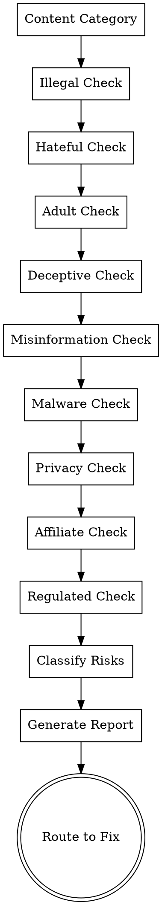

# Policy Risk Scanner

Comprehensive policy compliance risk assessment. Identifies content violations, prohibited material, deceptive practices, and policy risks that would block Google AdSense approval.

## Scoring Mode & Aggregation Contract

| Field | Value |
|---|---|
| **Default mode** | `Core 79` (PC01–PC11 always evaluated; PC12–PC13 only when triggered) |
| **Core 79 items** | PC01–PC11 (11 items) |
| **Extension items** | PC12 (gambling/regulated content), PC13 (tobacco/alcohol content) |
| **Extension trigger** | Include PC12–PC13 when site has gambling, tobacco, or alcohol content |
| **Veto items** | PC10 (affiliate disclosure) — any fail = instant veto regardless of mode |
| **Any PC fail** | Treated as pillar-level veto; escalate to `ads-readiness-assessment` immediately |

**Output fields required** (for aggregation by `ads-readiness-assessment`):
- `score_mode`: one of `Core 79`, `Core 79 + Profile`, `Full 105`
- `pillar`: `PC`
- `items_evaluated`: list of item IDs actually checked
- `veto_triggered`: `true` / `false` + which item(s)
- `extension_findings`: any PC12–PC13 issues found even when in Core 79 mode (flag for operator)

**Rule**: Items not in scope for the chosen mode must be labeled `not_in_scope` — never omitted silently.

## Purpose

Detect policy compliance (PC) risks that would trigger rejections:
- Prohibited content (illegal, hateful, adult, dangerous)
- Deceptive and misleading claims
- Harmful health/financial misinformation
- Malware and unwanted software
- Data protection and privacy issues
- Affiliate disclosure violations
- Regulated content handling (gambling, tobacco, alcohol)

## Quick Start

**Input**: Website content or URL
**Output**: Risk classification (Critical/High/Medium/Low) + remediation paths
**Optional Scripts**: Keyword matching, content scanning
**Time**: 10-20 minutes

## Workflow

### Step 1: Content Category Assessment

Determine site's primary content categories and associated risks:
- Adult/explicit content potential
- Health/medical claims potential
- Financial/investment advice potential
- Gambling/betting potential
- Tobacco/alcohol content potential
- Legal/regulated content potential

### Step 2: Prohibited Content Scan

Scan for explicitly prohibited material:
- Illegal content (hacking guides, counterfeits, IP infringement) (PC01)
- Dangerous/hateful content (threats, harassment, targeted attacks) (PC02)
- Explicit sexual content (without proper adult agreement) (PC03)
- Deceptive claims (false health, financial, electoral claims) (PC04)
- Health misinformation (anti-vaccine, COVID denial, conversion therapy) (PC05)
- Facilitation of dishonesty (forgery guides, academic dishonesty) (PC06)
- Malware/unwanted software (downloads without consent) (PC07)
- Animal abuse (dogfighting, wildlife trafficking) (PC08)

### Step 3: Policy Area Assessment

Evaluate specific policy areas:
- Affiliate disclosure presence/visibility (PC10)
- Regulated content proper handling (PC09)
- Ad quantity compliance (PC12)
- Ad code placement (PC13)
- User data rights availability (PC11)

### Step 4: Risk Classification

Score findings by severity:
- **Critical** (blocks approval): Illegal content, harmful health misinformation, malware
- **High** (likely rejection): Deceptive claims, missing affiliate disclosure, adult content
- **Medium** (may cause issues): Missing privacy policy, improper regulated content
- **Low** (minor issue): Ad placement suboptimal

### Step 5: Generate Risk Report

Produces detailed risk report with:
- Overall compliance score (0-100)
- Risk categories and counts
- Specific problem URLs/content
- Remediation paths for each risk
- Legal/policy references

## Checklist

1. ✓ Identify content categories
2. ✓ Scan for illegal content (PC01)
3. ✓ Scan for hateful/dangerous content (PC02)
4. ✓ Check for explicit sexual content (PC03)
5. ✓ Scan for deceptive claims (PC04)
6. ✓ Check for health misinformation (PC05)
7. ✓ Check for dishonesty facilitation (PC06)
8. ✓ Check for malware/unwanted software (PC07)
9. ✓ Check for animal abuse content (PC08)
10. ✓ Verify affiliate disclosures (PC10)
11. ✓ Check regulated content handling (PC09)
12. ✓ Review privacy policy (PC11)
13. ✓ Check ad quantity (PC12)
14. ✓ Verify ad code placement (PC13)
15. ✓ Classify risks by severity
16. ✓ Generate risk report
17. ✓ Export JSON + Markdown
18. ✓ Route to policy-remediation-plan for fixes

## Process Flow



## Detailed Risk Categories

### Illegal Content (PC01) — CRITICAL

**Criteria**:
- Hacking guides or tutorials
- Counterfeit goods sales or promotion
- IP infringement (piracy, stolen content)
- Controlled substance sales
- Weapons sales or illegal weaponry
- Forged documents or credentials
- Human trafficking content

**Detection**:
- Keywords: "crack software", "counterfeit", "buy drugs", "fake passport"
- Download links to suspicious files
- Marketplace listings for contraband

**Risk**: CRITICAL - Automatic rejection

---

### Hateful & Dangerous Content (PC02) — CRITICAL

**Criteria**:
- Incitement to violence or terrorism
- Harassment, threats, bullying
- Targeted attacks on groups/individuals
- Slurs or dehumanizing language
- Calls for violence against persons
- Extremist propaganda

**Detection**:
- Violent rhetoric analysis
- Targeted harassment campaigns
- Extremist organization affiliations
- Threat language patterns

**Risk**: CRITICAL - Automatic rejection

---

### Adult/Explicit Content (PC03) — HIGH (Unless Proper Agreement)

**Criteria**:
- Sexually explicit imagery or videos
- Pornographic content
- Graphic sexual descriptions
- Adult services (escort, cam, etc.)

**Exceptions**:
- Educational/medical content (anatomy, reproduction)
- Artistic nude content (with proper context)
- Sites with valid AdSense Adult Content agreement

**Detection**:
- Image analysis
- Text pattern recognition
- Metadata scanning

**Risk**: HIGH - Likely rejection without agreement

---

### Deceptive & Misleading Claims (PC04) — HIGH

**Criteria**:
- False health claims (miracle cures, unproven treatments)
- False financial claims (guaranteed returns, get-rich schemes)
- False election/voting claims
- Impersonation (fake credentials, false authority)
- Misleading comparisons or statistics

**Detection**:
- Claims analysis against scientific consensus
- Fact-checking against credible sources
- Pattern recognition for common scams

**Examples**:
- "This supplement cures cancer" (unproven)
- "Double your money in 24 hours" (unrealistic)
- "Lose 50 pounds in 1 week" (dangerous/false)

**Risk**: HIGH - Likely rejection

---

### Health Misinformation (PC05) — CRITICAL

**Criteria**:
- Anti-vaccine content or vaccine hesitancy
- COVID-19 denial or conspiracy theories
- Conversion therapy promotion
- Denial of established medical facts
- Dangerous medical advice
- Promotion of quackery

**Detection**:
- Known misinformation sources/claims
- Fact-checking against WHO, CDC, medical authorities
- Context analysis

**Risk**: CRITICAL - Automatic rejection

---

### Facilitation of Dishonesty (PC06) — HIGH

**Criteria**:
- Hacking/credential theft tutorials
- Academic dishonesty guides (essay mills, cheating)
- Phishing or social engineering guides
- Fraud tutorials
- Plagiarism facilitation
- Test cheating guides

**Detection**:
- Tutorial content analysis
- Step-by-step instruction patterns
- Illegal activity facilitation language

**Risk**: HIGH - Likely rejection

---

### Malware & Unwanted Software (PC07) — CRITICAL

**Criteria**:
- Downloads that install spyware, malware, trojans
- Forced/deceptive software installation
- Ransomware distribution
- Botnet/zombie computer recruitment
- Unwanted browser modifications

**Detection**:
- Download file analysis (if possible)
- Security database cross-reference
- Installation prompt examination
- Software bundle analysis

**Risk**: CRITICAL - Automatic rejection

---

### Animal Abuse (PC08) — CRITICAL

**Criteria**:
- Dogfighting or cockfighting promotion/content
- Wildlife trafficking
- Endangered species sales
- Animal torture or abuse content
- Illegal hunting/trapping promotion

**Detection**:
- Content imagery and description analysis
- Marketplace listing detection
- Animal trafficking keywords

**Risk**: CRITICAL - Automatic rejection

---

### Affiliate Link Compliance (PC10) — HIGH

**Criteria**:
- Any page with affiliate links MUST have visible disclosure
- Disclosure must be clear, conspicuous, and easy to find
- FTC requirements compliance
- Local jurisdiction requirements (UK, EU, Canada, etc.)

**Detection**:
- Scan for affiliate URL patterns (Amazon, CJA, Impact, etc.)
- Search for affiliate disclosure statements
- Verify visibility and conspicuousness

**Common Failures**:
- Affiliate links without any disclosure
- Disclosure buried in fine print
- Disclosure only in footer
- Generic "we may earn commissions" without clarity

**Remediation**:
- Add clear, visible disclosure before any affiliate link
- Example: "As an Amazon Associate, we earn from qualifying purchases"
- Disclosure should be at top of post or near link

**Risk**: HIGH - Common rejection reason

---

### Regulated Content Handling (PC09)

**For Gambling Content**:
- Must comply with AdSense gambling policy
- May need separate gambling agreement
- Geographic restrictions apply

**For Tobacco Content**:
- Limited to education, advocacy, medical topics
- No sales or promotion
- Age-gating may be required

**For Alcohol Content**:
- Educational/advocacy content allowed
- Sales not allowed
- Age restrictions required

**Risk**: MEDIUM-HIGH depending on content type

---

### User Data Rights (PC11)

**Criteria**:
- Privacy policy explaining how data is collected/used
- Users can request data deletion/export
- GDPR compliance (if EU users)
- CCPA compliance (if California users)
- Data retention policy

**Detection**:
- Privacy policy existence and completeness
- Data request process availability
- Consent mechanisms

**Risk**: MEDIUM - May cause approval delay

---

### Ad Quantity & Code Placement (PC12, PC13)

**PC12: Ad Quantity (Active Phase)**
- Max 3 ad units per page (excluding auto-ads)
- Violation more likely post-approval

**PC13: Ad Code Placement**
- Code in `<head>` or before `</body>` closing
- Not in HTML comments or broken tags
- Proper formatting

**Risk**: MEDIUM-HIGH - Post-approval focus

---

## Output Formats

### Risk Classification Report

```markdown
# Policy Compliance Risk Report
## Overall Compliance Score: 45/100

### CRITICAL RISKS — Must Fix Before Submission
- [PC05] Health Misinformation: Anti-vaccine content found
  Pages: /health/vaccines, /blog/alternatives-to-vaccines
  Recommendation: Remove or substantially revise
  
- [PC07] Malware Risk: Suspicious download detected
  Page: /tools/free-downloader
  Details: EXE file without clear consent messaging

### HIGH RISKS — Should Fix Before Submission
- [PC10] Missing Affiliate Disclosure (20 instances)
  Pages: 15 blog posts with Amazon affiliate links
  Recommendation: Add FTC disclosure statement
  
- [PC04] Deceptive Health Claims: "Cures arthritis" claim
  Page: /supplements/arthritis-miracle
  Recommendation: Soften to "may help" or add studies

### MEDIUM RISKS — Address Post-Approval
- [PC11] Incomplete Privacy Policy
  Missing: Data retention period, user deletion process
  
### LOW RISKS — Monitor
- [PC01] Regulated Content Setup
  Gambling content present; monitor for policy changes
```

### JSON Risk Analysis

```json
{
  "scan_date": "2026-05-03",
  "site_url": "https://example.com",
  "score_mode": "Core 79 + Profile",
  "items_evaluated": ["PC01", "PC02", "PC03", "PC04", "PC05", "PC06", "PC07", "PC08", "PC09", "PC10", "PC11"],
  "overall_score": 45,
  "veto_triggered": false,
  "risks": [
    {
      "criterion": "PC05",
      "severity": "CRITICAL",
      "type": "Health Misinformation",
      "count": 2,
      "pages": ["/health/vaccines"],
      "details": "Anti-vaccine claims without scientific support",
      "remediation": "Remove or provide scientific references"
    },
    ...
  ],
  "critical_count": 2,
  "high_count": 5,
  "medium_count": 3,
  "low_count": 1
}
```

## Supported Check Modes

### URL Mode
- Crawl and analyze all site content
- Automatic keyword matching
- Download file scanning (if applicable)
- Real-time policy database checking

### Source Mode
- Analyze local HTML/content files
- Static content analysis
- No live crawling needed

### Manual Mode
- Answer questions about content categories
- Upload content samples
- Manual review of problem areas
- Guided risk assessment

## Automated Scanning Scripts

Optional scripts for policy compliance scanning:

```bash
# Scan site for policy violations
npm run policy-scan https://example.com

# Generate risk report
npm run risk-report

# Find affiliate link violations
npm run affiliate-check

# Screen for prohibited keywords
npm run prohibited-keyword-scan
```

Outputs:
- `policy-violations.json` - Violations by criterion
- `risk-report.md` - Human-readable report
- `critical-issues.csv` - Issues needing immediate action
- `remediation-guide.md` - How to fix each issue

## Integration with Other Skills

```
[policy-risk-scanner] provides input to:
└─→ [policy-remediation-plan]
    ├─→ Content removal/revision strategies
    ├─→ Affiliate disclosure templates
    ├─→ Privacy policy generators
    ├─→ Data protection implementation
    └─→ Regulated content handling guides

[ads-readiness-assessment] calls this skill
[resubmission-readiness-check] verifies fixes
```

## Common Violations & Remediation

### Health Misinformation
**Issue**: "Our supplement cures cancer"
**Fix**: Rewrite to "May support immune health" with studies
**Time**: 1-2 hours per page
**Priority**: CRITICAL

### Missing Affiliate Disclosure
**Issue**: Amazon links without FTC disclosure
**Fix**: Add "As an Amazon Associate, we earn from..."
**Time**: 5-10 min per post
**Priority**: HIGH

### Deceptive Claims
**Issue**: "Guaranteed to lose 50 pounds"
**Fix**: Add disclaimers, use cautious language
**Time**: 30-60 min per page
**Priority**: HIGH

### Incomplete Privacy Policy
**Issue**: No data deletion/export process described
**Fix**: Update privacy policy + add request form
**Time**: 2-4 hours
**Priority**: MEDIUM

### Unverified Medical Claims
**Issue**: Recommending treatment without evidence
**Fix**: Add disclaimers, cite studies, recommend doctors
**Time**: 1-2 hours per page
**Priority**: CRITICAL

## Key Principles

1. **User Safety First**: Google prioritizes user safety over content freedom
2. **Scientific Consensus**: Claims must align with established science
3. **Transparency**: Clear disclosure of financial interests and risks
4. **Data Protection**: User data must be properly protected
5. **No Manipulation**: No deceptive design or dishonest claims

## Next Steps

1. **Critical Issues**: Fix or remove critical violations immediately
2. **High Priority**: Address before submission
3. **Medium Issues**: Plan for post-approval fixes
4. **Documentation**: Keep evidence of fixes for resubmission
5. **Verification**: Re-run scan after major revisions

---

**Related Skills**:
- Fix policy issues → `policy-remediation-plan`
- Full site assessment → `ads-readiness-assessment`
- Final verification → `resubmission-readiness-check`
