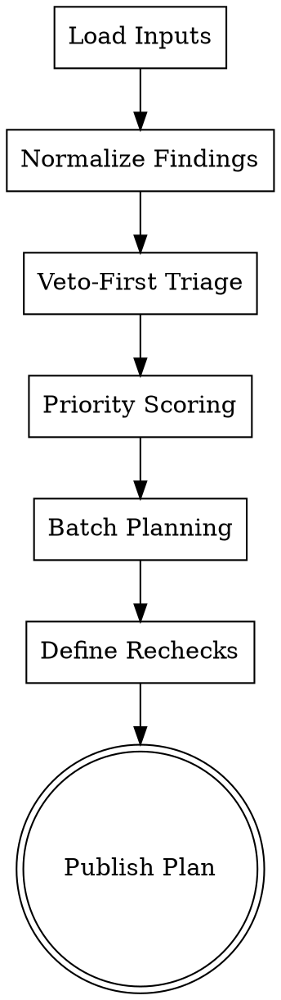

# SCB Execution Planner

Operational planning layer for SCB remediation. Transforms score output into an implementation backlog with priority, owner-ready tasks, and verification gates.

## Purpose

Turn SCB findings into execution:
- Prioritize veto and high-impact gaps first
- Convert item failures into actionable tasks
- Sequence fixes by effort and weighted ranking impact
- Define recheck cadence and pass criteria
- Produce implementation-ready markdown and JSON artifacts

## Quick Start

Input: SCB score report + profile manifest + resource constraints
Output: Prioritized remediation plan + recheck schedule + progress tracker
Optional Scripts: Task exporter, issue template generator, status dashboard
Time: 10-25 minutes per audit package

## Required Inputs

| Field | Required | Default | Notes |
|------|----------|---------|-------|
| scb_report | Yes | - | Item-level scores, pillar scores, veto status |
| profile_manifest | Yes | - | From scb-profile-router |
| implementation_window_days | No | 30 | Planning horizon |
| team_capacity | No | medium | low / medium / high |
| risk_tolerance | No | balanced | strict / balanced / aggressive |

## Scoring Mode & Aggregation Contract

Planner must preserve and echo scoring scope from input:
- score_mode
- covered_items
- selected_profile_items
- triggered_extension_items
- missing_items

Planner-specific output fields:
- remediation_batches
- veto_blockers
- quick_wins
- impact_estimate
- recheck_plan
- completion_criteria

## Workflow

### Step 1: Parse and Normalize Findings

Read SCB inputs and standardize issue objects:
- item_id
- pillar
- current_score
- target_score
- veto_related
- evidence_links

### Step 2: Run Veto-First Triage

Immediate blockers:
- IQ12, IA02, IA10, FC14
- EA08 when ymyl=true

If any veto is active, mark plan_status as blocked_until_veto_fixed.

### Step 3: Compute Priority Score

Recommended formula:
- priority = gap_size x pillar_weight x risk_multiplier x confidence

Where:
- gap_size = target_score - current_score
- pillar_weight from resolved profile manifest
- risk_multiplier increases for veto, YMYL, or legal/compliance risk
- confidence reflects evidence quality

### Step 4: Build Remediation Batches

Batching logic:
- Batch 1: veto blockers and severe trust/intent failures
- Batch 2: high weighted gains (usually IA, EA, IQ depending on profile)
- Batch 3: UX/GE optimization and scalability improvements

### Step 5: Add Verification Gates

For each batch define:
- acceptance checks
- sample evidence requirements
- re-score scope (partial or full)
- owner-ready checklist

### Step 6: Emit Execution Plan

Produce markdown roadmap and machine-readable JSON plan.

## Checklist

1. Validate scb_report completeness
2. Validate profile_manifest scope and weights
3. Normalize issue list
4. Detect active veto blockers
5. Compute weighted priority
6. Group tasks into remediation batches
7. Define acceptance checks for each batch
8. Set recheck cadence and threshold
9. Export markdown roadmap
10. Export JSON execution plan

## Process Flow



## Detailed Planning Rules

### Severity Bands

- Critical: veto item score 0 or legal/risk critical issue
- High: score 0-1 on high-weight pillar items
- Medium: score 2 on weighted pillars or score 0-1 on lower-weight items
- Low: score 3 with optimization opportunity to 4-5

### Target Score Policy

- Veto items: target 4 minimum before re-entry
- Core weighted items: target 4 for top-2 weighted pillars
- Extension items: target 3-4 depending on implementation window

### Recheck Policy

- Batch 1 complete -> immediate partial recheck on veto + directly related items
- Batch 2 complete -> focused recheck on top weighted pillars
- Batch 3 complete -> full-mode recheck using current score_mode

## Output Formats

### Markdown Roadmap

```markdown
# SCB Remediation Roadmap
- Score Mode: Core 80 + Profile
- Current Total: 63 (Needs Work)
- Target Total: 78 (Near Ready)
- Active Veto: IA02

## Batch 1 (Days 1-7)
- IA02 SERP Format Alignment: rebuild structure to match dominant result format
- IQ12 Originality Gate: remove derivative blocks and add first-party evidence

Acceptance:
- Veto items cleared
- Updated evidence attached
- Partial recheck passed

## Batch 2 (Days 8-20)
- EA13 Citation hardening
- IQ05 Information Gain expansion
- IA11 SERP feature targeting updates

## Batch 3 (Days 21-30)
- UX04 summary enhancement
- GE11 snippet block optimization
- GE14 schema completeness
```

### JSON Plan Contract

```json
{
  "meta": {
    "score_mode": "Core 80 + Profile",
    "planning_window_days": 30,
    "planner_version": "1.0",
    "timestamp": "2026-05-05T00:00:00Z"
  },
  "scope": {
    "covered_items": ["IQ01", "..."],
    "selected_profile_items": ["IQ15", "EA14"],
    "triggered_extension_items": ["IA17"],
    "missing_items": []
  },
  "summary": {
    "current_total_score": 63,
    "target_total_score": 78,
    "grade_now": "Needs Work",
    "grade_target": "Near Ready",
    "plan_status": "blocked_until_veto_fixed"
  },
  "veto_blockers": [
    {"item_id": "IA02", "current_score": 0, "target_score": 4}
  ],
  "remediation_batches": [
    {
      "batch_id": "B1",
      "priority": "critical",
      "timebox_days": 7,
      "items": ["IA02", "IQ12"],
      "acceptance_checks": ["veto_cleared", "evidence_attached"]
    }
  ],
  "recheck_plan": [
    {"after_batch": "B1", "mode": "partial", "items": ["IA02", "IQ12"]},
    {"after_batch": "B3", "mode": "full", "items": ["all_in_scope"]}
  ],
  "completion_criteria": {
    "all_veto_cleared": true,
    "target_score_reached": true,
    "critical_items_below_3": 0
  }
}
```

## Supported Check Modes

- URL Mode: plan against live page findings
- Source Mode: plan against repository scoring output
- Manual Mode: plan from analyst-provided score sheet

## Integration with Other Skills

Typical SCB chain:
1. scb-profile-router
2. scoring run using seo-content-benchmark + scb-rubric-guidelines
3. scb-execution-planner
4. content-improvement-blueprint and technical-remediation-guide (when needed)

## Common Planning Failures and Fixes

### No Veto-First Handling
Problem: teams optimize UX/GE while veto remains active
Fix: force blocked status until veto items meet target

### Overloading One Sprint
Problem: too many medium tasks dilute high-impact work
Fix: cap batch size by capacity and keep high-weight pillars first

### Missing Evidence in Recheck
Problem: score changes are proposed without proof
Fix: require evidence_links per task before re-evaluation

## Next Steps

1. Ingest latest SCB report and profile manifest
2. Generate batch plan and assign owners
3. Execute Batch 1 and run partial recheck
4. Iterate through Batch 2 and Batch 3 until target criteria are met

---
Related Skills:
- scb-profile-router
- content-improvement-blueprint
- technical-remediation-guide
- competitive-benchmark
