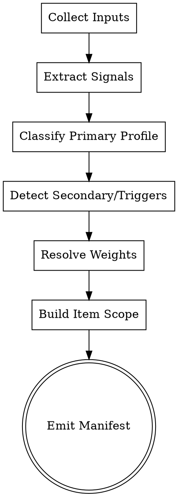

# SCB Profile Router

Profile-aware routing layer for SCB v2.0. Detects the best-fit content profile, applies cross-profile rules, and emits a strict manifest contract used by scoring and remediation skills.

## Purpose

Route content into the correct SCB profile logic before scoring:
- Detect primary profile from content signals and query intent
- Resolve profile weights and extension item set
- Apply conditional triggers and multilingual rules
- Standardize scope for Core 80, Core 80 + Profile, and Full 106
- Reduce reviewer inconsistency in multi-profile scenarios

## Quick Start

Input: URL or source path + optional profile hint
Output: Profile manifest in Markdown + JSON
Optional Scripts: Content classifier, schema parser, heading/entity extractor
Time: 5-12 minutes per URL/page

## Required Inputs

| Field | Required | Default | Notes |
|------|----------|---------|-------|
| url_or_path | Yes | - | Target page URL or local source path |
| score_mode | No | Core 80 + Profile | Core 80 / Core 80 + Profile / Full 106 |
| ymyl | No | auto | true / false / auto |
| language_scope | No | single | single / multilingual |
| profile_hint | No | none | long-form/news/review/how-to/ymyl/tool/comparison/ugc |
| query_context | No | none | target query or keyword cluster for better routing |

## Scoring Mode & Aggregation Contract

This router does not assign final item scores. It defines scope and weighting contract for downstream scoring.

- Core 80: include only core items for all 6 pillars
- Core 80 + Profile: include core items + selected profile extension items + triggered items
- Full 106: include all items

Mandatory output fields:
- score_mode
- selected_profile
- secondary_profiles
- pillar_weights
- covered_items
- selected_profile_items
- triggered_extension_items
- missing_items
- veto_watchlist
- routing_confidence

## Workflow

### Step 1: Collect Evidence

Gather structural and semantic signals:
- Title/H1 patterns
- Presence of steps, comparisons, date pegs, first-person testing, forum/reply patterns
- Entity signals (product, organization, person)
- Topic risk and YMYL cues

### Step 2: Classify Primary Profile

Map to one of 8 SCB profiles:
- Long-form Guide
- News and Trending
- Product Review
- How-to and Tutorial
- YMYL Content
- Tool and Landing Page
- Comparison and Alternative
- UGC and Community

If profile_hint is present, treat it as prior evidence, not an override.

### Step 3: Detect Secondary Profiles and Triggers

Apply cross-profile and conditional rules:
- Long-form + YMYL
- Review + YMYL
- Comparison + Affiliate
- How-to + News
- Tool + Comparison
- Any + multilingual (IA17, GE16)

### Step 4: Resolve Weight Matrix

Default rule:
- Single profile: use profile weight table from SCB
- Multi-profile: take stricter weights by pillar (higher risk priority)

Output must include an explanation for each merged pillar weight.

### Step 5: Build Item Scope

Compute final item set by score mode:
- Core 80
- Core 80 + selected profile extension items + triggered extension items
- Full 106

Mark non-applicable items explicitly in na_items; do not silently drop.

### Step 6: Emit Profile Manifest

Export normalized JSON and summary markdown for downstream skills.

## Checklist

1. Identify URL/path and score mode
2. Extract structural/semantic/profile signals
3. Assign primary profile and confidence
4. Detect secondary profiles and trigger rules
5. Resolve merged pillar weights
6. Select extension and triggered items
7. Build covered_items and missing_items
8. Flag veto_watchlist items
9. Export manifest JSON
10. Export markdown summary for operator review

## Process Flow



## Detailed Routing Rules

### Profile Signal Priority

1. Explicit page pattern (for example: vs, alternatives, review)
2. Content structure (steps/tutorial, thread/replies, changelog/news)
3. Intent pattern from query_context
4. YMYL risk cues (medical, legal, finance, safety)
5. Product/tool UI dominance for landing/tool profile

### Veto Watchlist Defaults

Always return these as watchlist candidates:
- IQ12 (Originality Gate)
- IA02 (SERP Format Alignment)
- IA10 (No Keyword Stuffing)
- FC14 (Thin Content Ratio)
- EA08 when ymyl=true

### Confidence Logic

- High: >=0.85 and no conflicting profile cluster
- Medium: 0.60-0.84 or one high-conflict secondary profile
- Low: <0.60; requires manual confirmation

## Output Formats

### Markdown Summary

```markdown
# SCB Profile Manifest
- URL: https://example.com/article
- Score Mode: Core 80 + Profile
- Selected Profile: Comparison and Alternative (0.89)
- Secondary Profiles: Product Review (0.63)
- YMYL: false
- Multilingual: true

## Resolved Weights
- IQ: 20%
- EA: 25%
- IA: 20%
- FC: 15%
- UX: 15%
- GE: 10%

## Item Scope
- Covered Items: 88
- Selected Profile Items: [IQ15, IQ06, EA16, EA14, FC04, FC15, GE05, GE11]
- Triggered Extension Items: [IA17, GE16]
- Veto Watchlist: [IQ12, IA02, IA10, FC14]
```

### JSON Contract

```json
{
  "meta": {
    "url_or_path": "https://example.com/article",
    "score_mode": "Core 80 + Profile",
    "router_version": "1.0",
    "timestamp": "2026-05-05T00:00:00Z"
  },
  "routing": {
    "selected_profile": "comparison",
    "routing_confidence": 0.89,
    "secondary_profiles": [
      {"profile": "review", "confidence": 0.63}
    ],
    "ymyl": false,
    "language_scope": "multilingual"
  },
  "scope": {
    "covered_items": ["IQ01", "..."],
    "missing_items": [],
    "na_items": [],
    "selected_profile_items": ["IQ15", "EA14", "GE05"],
    "triggered_extension_items": ["IA17", "GE16"],
    "veto_watchlist": ["IQ12", "IA02", "IA10", "FC14"]
  },
  "weights": {
    "IQ": 0.20,
    "EA": 0.25,
    "IA": 0.20,
    "FC": 0.15,
    "UX": 0.15,
    "GE": 0.10,
    "merge_explanation": [
      "EA took stricter weight from comparison profile"
    ]
  }
}
```

## Supported Check Modes

- URL Mode: crawl and infer from rendered page content
- Source Mode: parse local HTML/MD and frontmatter metadata
- Manual Mode: operator provides profile hints and evidence

## Integration with Other Skills

scb-profile-router feeds into:
- scoring workflow based on seo-content-benchmark
- scb-execution-planner for remediation sequencing
- competitive-benchmark for external context

Recommended chain:
1. scb-profile-router
2. scb scoring run (manual or agent)
3. scb-execution-planner

## Common Misrouting Cases and Fixes

### Review vs Comparison Collision
Problem: best tools pages are routed as single-product reviews
Fix: if 2+ named products and comparison table exists, elevate comparison profile

### How-to vs Long-form Collision
Problem: educational guides with few steps are routed as how-to
Fix: require explicit task completion sequence for how-to

### YMYL Under-detection
Problem: finance/legal pages routed as general long-form
Fix: apply stricter keyword and entity risk lexicon before final classification

## Next Steps

1. Run router and inspect routing_confidence
2. If confidence is low, confirm profile manually
3. Pass manifest to scoring and scb-execution-planner
4. Re-run router when page intent or format changes

---
Related Skills:
- seo-content-benchmark
- scb-rubric-guidelines
- scb-profiles
- competitive-benchmark
