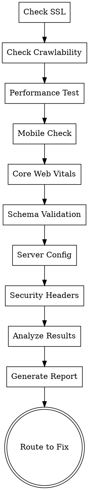

# Technical Health Audit

Comprehensive evaluation of your website's technical infrastructure, performance, security, and SEO foundations. Ensures your site meets all Technical Health (TH) requirements for Google AdSense approval.

## Purpose

Verify that your technical setup meets Technical Health (TH) criteria:
- HTTPS/SSL security
- Performance and Core Web Vitals
- Mobile responsiveness
- Security headers and configurations
- SEO technical requirements
- Accessibility and standards compliance

## Quick Start

**Input**: Website URL or local project
**Output**: Structured JSON + priority fixes + script recommendations
**Optional Scripts**: Lighthouse, performance testing, SSL verification
**Time**: 15-25 minutes

## Scoring Mode & Aggregation Contract

This skill contributes TH signals into one of three benchmark scopes:

- `Core 79`: required coverage is TH01-TH13
- `Core 79 + Profile`: required coverage is TH01-TH13 plus any TH extension items selected by profile or trigger rules
- `Full 105`: cover TH01-TH20

Structured outputs should include:
- `score_mode`
- `covered_items`
- `veto_items_checked`
- `selected_profile_items` limited to TH items
- `triggered_extension_items` limited to TH items

## Workflow

### Step 1: Initial Configuration Check

Verify basic technical setup:
- Is site HTTPS/SSL enabled? (TH01, TH02)
- Does robots.txt exist and allow crawling? (TH03)
- Is XML sitemap present? (TH04)
- Is ads.txt configured? (TH05)

### Step 2: Performance Assessment

Run performance tests:
- Core Web Vitals (LCP, CLS, FID) (TH11, TH12)
- Page load speed (TH06)
- Largest Contentful Paint (LCP)
- Cumulative Layout Shift (CLS)
- First Input Delay (FID)
- Optional: Lighthouse integration

### Step 3: Technical Configuration

Verify proper setup:
- Canonical tags (TH09)
- Structured data/schema markup (TH13)
- Mobile responsiveness (TH07)
- Viewport meta tag
- Device compatibility

### Step 4: Server & Optimization

Check server-side configurations:
- CDN implementation (TH17)
- Gzip/Brotli compression (TH18)
- Image optimization (TH19)
- Third-party scripts (TH20)
- DNS resolution speed (TH16)
- Uptime monitoring (TH15)

### Step 5: Accessibility & Standards

Verify standards compliance:
- Custom 404 page (TH14)
- Broken link detection (TH08)
- HTML/CSS validation
- WCAG accessibility standards

### Step 6: Generate Report

Produces detailed technical report with:
- Overall technical score (0-100)
- Declared score mode and TH scope used
- Per-criterion compliance
- Performance metrics and benchmarks
- Server configuration details
- Recommended fixes and priority order

If running in `Core 79` mode, TH14-TH20 should be labeled `not_in_scope` unless a profile or trigger explicitly adds them.

## Checklist

1. ✓ Select input mode (URL or source)
2. ✓ Verify HTTPS/SSL (TH01-02)
3. ✓ Check robots.txt (TH03)
4. ✓ Verify XML sitemap (TH04)
5. ✓ Check ads.txt (TH05)
6. ✓ Test page load speed (TH06)
7. ✓ Verify mobile responsiveness (TH07)
8. ✓ Scan broken links (TH08)
9. ✓ Check canonical tags (TH09)
10. ✓ Verify ad code implementation (TH10)
11. ✓ Measure Core Web Vitals - FID (TH11)
12. ✓ Measure Core Web Vitals - CLS (TH12)
13. ✓ Check structured data (TH13)
14. ✓ Verify custom 404 page (TH14)
15. ✓ Check uptime monitoring (TH15)
16. ✓ Measure DNS resolution (TH16)
17. ✓ Verify CDN implementation (TH17)
18. ✓ Check compression (TH18)
19. ✓ Verify image optimization (TH19)
20. ✓ Analyze third-party scripts (TH20)
21. ✓ Generate comprehensive report
22. ✓ Export JSON + Markdown
23. ✓ Route to technical-remediation-guide for fixes

## Process Flow



## Detailed Criteria

### Security (TH01-TH02)

**TH01: HTTPS Enabled** ⚠️ VETO Item
- All pages served over HTTPS (not HTTP)
- Automatic HTTP → HTTPS redirect in place
- No mixed content warnings
- Critical: Blocks approval if missing

**TH02: SSL Certificate Valid**
- Certificate not expired
- Valid for the domain (no mismatches)
- Issued by trusted CA
- No self-signed certificates

### Crawlability (TH03-TH04)

**TH03: robots.txt**
- File exists at root domain
- Does NOT block Googlebot for key sections
- Allow rule for Googlebot if needed

**TH04: XML Sitemap**
- sitemap.xml exists and is valid
- Or declared in robots.txt
- Contains all major URLs
- Updated regularly

### Ads Configuration (TH05, TH10, TH13)

**TH05: ads.txt**
- Required if using programmatic ads
- Placed at domain root
- Lists authorized ad networks

**TH10: Ad Code Implementation**
- AdSense code placed correctly
- In `<head>` or before `</body>` closing tag
- No code in HTML comments or broken tags
- Auto-ads or ad units both acceptable

**TH13: Structured Data**
- Schema markup implemented (Article, Product, Recipe, etc.)
- Valid JSON-LD or microdata format
- No validation errors
- Relevant to page content

### Performance (TH06, TH11-TH12)

**TH06: Page Load Speed**
- Homepage loads in <3 seconds (standard connection)
- LCP metric: <2.5 seconds
- Baseline: Use CrUX data or WebPageTest

**TH11: Core Web Vitals - First Input Delay**
- FID <100ms on mobile (field data via CrUX)
- Tests responsiveness to user input

**TH12: Core Web Vitals - Cumulative Layout Shift**
- CLS <0.1 on mobile (field data via CrUX)
- Prevents layout jank/shifting

### Mobile & Responsiveness (TH07)

**TH07: Mobile-Responsive Design**
- Viewport meta tag present: `<meta name="viewport" content="width=device-width, initial-scale=1">`
- Layout renders correctly on mobile devices
- Touch targets appropriately sized
- Text readable without zooming

### Link & Navigation (TH08, TH09)

**TH08: Broken Links**
- Homepage and top-level pages have no 404s
- Primary navigation links working
- Key internal links functional

**TH09: Canonical Tags**
- Self-referencing canonical on all major pages
- Prevents duplicate content issues
- Format: `<link rel="canonical" href="..." />`

### Server Configuration (TH14-TH18, TH20)

**TH14: Custom 404 Page**
- Custom 404 page (not server default)
- Contains navigation links to homepage/main sections
- Helpful message for users

**TH15: Uptime Monitoring**
- Evidence of uptime monitoring
- >99% uptime over past 30 days
- Not completely down for extended periods

**TH16: DNS Resolution Speed**
- DNS completes in <200ms
- Tested from common geographic regions
- Fast resolution prevents delays

**TH17: CDN Implementation**
- CDN or caching used for static assets
- Images, CSS, JS served from edge
- Reduces latency for global users

**TH18: Resource Compression**
- Gzip or Brotli compression enabled
- Text resources (HTML, CSS, JS) compressed
- Reduces bandwidth and improves speed

**TH19: Image Optimization**
- Modern formats used (WebP, AVIF) where supported
- Proper compression applied
- Lazy loading for below-fold images
- Responsive image sizes

**TH20: Third-Party Script Count**
- Fewer than 15 third-party scripts on homepage
- Scripts don't block critical rendering path
- Async/defer attributes where applicable
- Performance impact minimized

## Output Formats

### Structured JSON Report
```json
{
  "audit_date": "2026-05-03",
  "site_url": "https://example.com",
  "score_mode": "Core 79 + Profile",
  "items_evaluated": ["TH01", "TH02", "TH03", "TH04", "TH05", "TH06", "TH07", "TH08", "TH09", "TH10", "TH11", "TH12", "TH13"],
  "overall_score": 82,
  "criteria": {
    "TH01": { "status": "pass", "details": "HTTPS enabled" },
    "TH02": { "status": "pass", "cert_expiry": "2027-06-15" },
    "TH06": { "status": "warning", "lcp_ms": 2800, "target": 2500 },
    ...
  },
  "performance_metrics": {
    "lcp": 2800,
    "cls": 0.08,
    "fid": 95
  },
  "next_steps": [...]
}
```

### Markdown Report
```markdown
# Technical Audit Report
## Overall Score: 82/100

### Critical Issues
- TH01 HTTPS Not Enabled
  All pages must be HTTPS

### High Priority
- TH06 Performance Below Target
  LCP: 2.8s (target <2.5s)
  
### Medium Priority
- TH17 No CDN Detected
  Implement CDN for static assets

### Recommendations
1. Enable HTTPS immediately
2. Optimize images and enable compression
3. Implement CDN for geographic distribution
```

### Performance Comparison
- Benchmarks against similar sites
- Historical performance trends
- Device-specific breakdowns (mobile vs. desktop)

## Supported Check Modes

### URL Mode (Recommended for Live Sites)
- Live performance testing with real-world metrics
- Lighthouse audit via API
- WebPageTest integration
- CrUX data (Core Web Vitals field data)

### Source Mode
- Parse HTML/CSS/JS from local files
- Configuration analysis (no live requests)
- Schema markup validation
- Static analysis

### Manual Mode
- Answer questions about server setup
- Upload configuration files
- Manual performance testing walkthrough

## Automated Scripts

Optional scripts for automation:

```bash
# Full technical audit
node technical-audit/checks.js https://example.com

# Performance testing only
npm run perf-test

# Schema validation
npm run validate-schema

# Generate Lighthouse report
npm run lighthouse-report
```

Outputs:
- `technical-violations.json` - Issues found
- `performance-report.md` - Performance analysis
- `lighthouse-report.html` - Full Lighthouse report
- `fixes-required.csv` - Prioritized action list

## Integration with Other Skills

```
[technical-audit] provides input to:
└─→ [technical-remediation-guide]
    ├─→ Nginx/Apache configuration fixes
    ├─→ Performance optimization strategies
    ├─→ SSL/security setup
    └─→ CDN implementation guide

[ads-readiness-assessment] calls this skill
[health-check-automation] verifies ongoing compliance
```

## Common Issues & Fixes

### No HTTPS (TH01)
**Problem**: Site running on HTTP
**Fix**: SSL certificate + server configuration
**Time**: 1-4 hours
**Priority**: CRITICAL - blocks approval

### Slow Performance (TH06)
**Problem**: LCP >2.5s or CLS >0.1
**Fix**: Image optimization, CDN, code splitting
**Time**: 4-20 hours
**Priority**: HIGH

### Missing sitemap (TH04)
**Problem**: No XML sitemap
**Fix**: Generate and submit to GSC
**Time**: 30-60 minutes
**Priority**: HIGH

### No Mobile Responsiveness (TH07)
**Problem**: Not mobile-friendly
**Fix**: Viewport meta tag + responsive CSS
**Time**: 2-8 hours
**Priority**: HIGH

### Broken Links (TH08)
**Problem**: 404s on main pages
**Fix**: Fix broken links or redirects
**Time**: 30-60 minutes
**Priority**: MEDIUM

## Performance Benchmarks

- **Excellent**: LCP <2.5s, CLS <0.1, FID <100ms
- **Good**: LCP <3.2s, CLS <0.25, FID <200ms
- **Poor**: LCP >4.5s, CLS >0.5, FID >300ms

Use actual measurements from CrUX or Lighthouse.

## Next Steps

1. **Critical Issues**: Fix HTTPS and major blockers immediately
2. **Performance**: Optimize images and implement CDN
3. **Configuration**: Update XML sitemap, canonical tags, schema
4. **Testing**: Re-run audit after improvements
5. **Verification**: Use `resubmission-readiness-check` before submission

---

**Related Skills**:
- Fix technical issues → `technical-remediation-guide`
- Full site assessment → `ads-readiness-assessment`
- Ongoing monitoring → `health-check-automation`
- Final verification → `resubmission-readiness-check`
