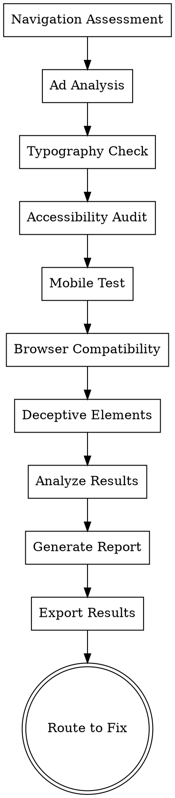

# UX Compliance Audit

Comprehensive evaluation of user experience, accessibility, and compliance with Google's UX standards. Ensures your site is accessible, navigable, and ad-friendly for all users across all devices.

## Scoring Mode & Aggregation Contract

| Field | Value |
|---|---|
| **Default mode** | `Core 79 + Profile` (UX01–UX15 always; UX16–UX18 when site type activates them) |
| **Core 79 items** | UX01–UX15 (15 items) |
| **Extension items** | UX16 (progressive web app / offline UX), UX17 (dark mode support), UX18 (custom 404 / error UX) |
| **Extension trigger** | UX16 when site type = Tool/SaaS; UX17 when News or Blog with high return traffic; UX18 always recommended but only scored in Full 105 or explicit trigger |
| **Veto items** | None in UX pillar; but UX09 (return-button hijacking) escalates to Critical and may cause PC cross-flag |

**Output fields required** (for aggregation by `ads-readiness-assessment`):
- `score_mode`: one of `Core 79`, `Core 79 + Profile`, `Full 105`
- `pillar`: `UX`
- `items_evaluated`: list of item IDs actually checked
- `critical_flags`: any UX items rated Critical (e.g., UX09)
- `extension_findings`: any UX16–UX18 issues observed even when in Core 79 mode

**Rule**: Items not in scope for the chosen mode must be labeled `not_in_scope` — never omitted silently.

## Purpose

Verify that your UX meets User Experience (UX) criteria:
- Clear navigation and site structure
- Content-to-ad ratio appropriate
- No intrusive interstitials or deceptive UI
- Readable typography and layout
- Accessibility compliance (WCAG AA)
- Mobile usability and responsiveness

## Quick Start

**Input**: Website URL or design files
**Output**: Visual survey + screenshots + WCAG report
**Manual Checks**: Navigation, typography, accessibility
**Time**: 20-30 minutes

## Workflow

### Step 1: Site Structure Assessment

Evaluate navigation and site architecture:
- Clear site navigation menu visible on all pages (UX01)
- Logical information hierarchy
- Category organization
- Search/filter functionality for large sites (UX10)

### Step 2: Ad & Content Analysis

Verify ad placement and content ratio:
- Content-to-ad ratio acceptable (<30% ads) (UX02)
- Ads not intrusive or deceptive (UX03, UX06)
- Ad placement doesn't interfere with navigation (UX08)
- No return-button hijacking (UX09)

### Step 3: Readability & Typography

Assess visual presentation:
- Font size ≥14px for body text (UX04)
- Sufficient line-height and spacing
- Proper color contrast (WCAG AA) (UX11)
- Content not cramped or crowded
- Logical reading flow

### Step 4: Accessibility Verification

Check accessibility compliance:
- Alt text on informative images (UX12)
- Color contrast ratios ≥4.5:1 normal, ≥3:1 large (UX11)
- Keyboard navigation functional
- Screen reader compatible
- WCAG AA compliance

### Step 5: Cross-Browser & Mobile

Verify compatibility:
- Chrome, Firefox, Safari rendering (UX07)
- Mobile responsiveness (UX07)
- Touch target sizing
- Mobile viewport configuration

### Step 6: Deceptive Elements Check

Scan for problematic UI:
- No fake "close" X buttons (UX06)
- No fake download buttons
- No misleading CTAs
- Navigation buttons not obscured by ads

### Step 7: Generate Report

Produces detailed UX report with:
- Overall UX compliance score (0-100)
- Per-criterion evaluation
- Accessibility report (WCAG)
- Mobile usability assessment
- Screenshots highlighting issues
- Recommendations for improvement

## Checklist

1. ✓ Evaluate site navigation (UX01)
2. ✓ Measure content-to-ad ratio (UX02)
3. ✓ Check for intrusive interstitials (UX03)
4. ✓ Verify typography and readability (UX04)
5. ✓ Check internal link paths (UX05)
6. ✓ Scan for deceptive UI elements (UX06)
7. ✓ Test cross-browser compatibility (UX07)
8. ✓ Verify ad placement (UX08)
9. ✓ Check return button integrity (UX09)
10. ✓ Verify search/filtering (UX10)
11. ✓ Test color contrast (UX11)
12. ✓ Check image alt text (UX12)
13. ✓ Verify link functionality (UX13)
14. ✓ Test mobile responsiveness (UX14)
15. ✓ Verify footer/legal links (UX15)
16. ✓ Run accessibility audit (WCAG)
17. ✓ Generate comprehensive report
18. ✓ Export annotated screenshots
19. ✓ Route to ux-optimization-roadmap for fixes

## Process Flow



## Detailed Criteria

### Navigation & Structure (UX01, UX05, UX10, UX13)

**UX01: Clear Site Navigation**
- Menu or nav bar visible and accessible
- Links to main categories present
- Navigation consistent across all pages
- Mobile menu accessible on smaller screens

**UX05: Internal Link Paths**
- Every page reachable within 3 clicks from homepage
- No orphan pages (unreachable from navigation)
- Breadcrumbs helpful where applicable
- Related content links present

**UX10: Search & Filtering**
- If site has >30 pages, search box present
- Category filters functional
- Results relevant and complete

**UX13: Link Functionality**
- All links working (no 404s in navigation)
- Links open in expected context (not unexpected new tabs)
- Link text descriptive

### Ad & Content Presentation (UX02, UX03, UX06, UX08, UX09)

**UX02: Content-to-Ad Ratio** (Active Phase Critical)
- Ads occupy <30% of visible viewport
- Content is dominant visual element
- Users see content before scrolling

**UX03: No Intrusive Interstitials**
- No full-screen pop-ups on page load that block reading
- Pop-ups either absent or easily closeable
- Google requires dismissal to proceed to content

**UX06: No Deceptive UI**
- No fake "close" buttons disguised as X
- No fake download buttons linking to ads
- No misleading CTAs (e.g., "Skip Ad" buttons)
- Ad labels clear and honest

**UX08: Ad Placement**
- Ads not directly adjacent to navigation buttons
- Ads not above search bars
- Ads not obscuring important content
- Clear separation from interactive elements

**UX09: Return Button Not Hijacked**
- Browser back button works correctly
- Doesn't redirect to unexpected page
- Native behavior preserved

### Typography & Readability (UX04, UX11)

**UX04: Readable Typography**
- Body text ≥14px (16px ideal)
- Line-height 1.4-1.8 for readability
- Sufficient letter-spacing
- Paragraph lengths reasonable (not walls of text)
- Font choices readable (avoid excessive decorative fonts)

**UX11: Color Contrast (WCAG AA)**
- Normal text: contrast ratio ≥4.5:1
- Large text (≥18px): contrast ratio ≥3:1
- Test all text colors against backgrounds
- Tools: WAVE, Axe, WebAIM Contrast Checker

### Accessibility (UX12 + WCAG)

**UX12: Image Alt Text**
- Informative images have descriptive alt text
- Decorative images use alt="" 
- Alt text concise but descriptive
- Not just filename or "image"

**WCAG AA Compliance**:
- Perceivable: Text alternatives, adaptable content, distinguishable
- Operable: Keyboard accessible, enough time, seizure prevention
- Understandable: Readable, predictable, input assistance
- Robust: Compatible with assistive technologies

### Browser & Device Compatibility (UX07, UX14)

**UX07: Cross-Browser Compatibility**
- Chrome: Recent version
- Firefox: Recent version
- Safari: Recent version
- Layout, content, functionality work on all

**UX14: Mobile Responsiveness**
- Viewport meta tag present and correct
- Layout adapts to mobile screen sizes
- Touch targets ≥48×48px
- Text readable without zooming
- Navigation accessible on mobile

### Footer & Legal (UX15)

**UX15: Footer/Legal Links**
- Privacy policy link accessible
- Contact information present
- Social media links (if applicable)
- Copyright notice
- About/contact footer links

## Output Formats

### Visual Survey Report
```markdown
# UX Compliance Report
## Overall Score: 74/100

### Critical Issues
[Screenshot] UX02: Content-to-ad ratio 45%
  → Ads take up more than 30% of viewport
  
[Screenshot] UX03: Intrusive pop-up on page load
  → Full-screen overlay blocks content for 3 seconds

### High Priority
[Screenshot] UX04: Body text only 13px
  → Some users may struggle to read
  
[Screenshot] UX11: Color contrast 3.2:1
  → Below WCAG AA requirement of 4.5:1
```

### JSON Accessibility Report
```json
{
  "audit_date": "2026-05-03",
  "site_url": "https://example.com",
  "score_mode": "Core 79 + Profile",
  "items_evaluated": ["UX01", "UX02", "UX03", "UX04", "UX05", "UX06", "UX07", "UX08", "UX09", "UX10", "UX11", "UX12", "UX13", "UX14", "UX15"],
  "overall_score": 74,
  "accessibility_score": 74,
  "wcag_level": "AA",
  "wcag_violations": [
    {
      "criterion": "1.4.3 Contrast",
      "level": "AA",
      "instances": 5,
      "elements": [...]
    }
  ],
  "passed_criteria": [...]
}
```

### WCAG Audit Details
- All WCAG AA criteria status (Pass/Fail)
- Violations grouped by criterion
- Specific elements and line numbers
- Examples and fix suggestions

## Supported Check Modes

### URL Mode
- Visual crawl of live site
- Screenshot capture at various viewport sizes
- Automated accessibility scanning
- Real device testing (if available)

### Design File Mode
- Upload mockups or design files
- Check design against UX standards
- Verify accessibility in design phase

### Manual Mode
- Interactive guided UX assessment
- Manual screenshot upload
- Answer questions about UX decisions
- Step-by-step accessibility review

## Automated Accessibility Testing

Optional scripts for accessibility scanning:

```bash
# Full accessibility audit
npm run a11y-audit https://example.com

# Generate WCAG report
npm run wcag-report

# Screenshot comparison tool
npm run screenshot-compare mobile desktop
```

Outputs:
- `accessibility-violations.json` - Issues by criterion
- `wcag-report.md` - Human-readable report
- `screenshots/` - Annotated screenshots
- `contrast-failures.csv` - Color contrast issues

## Integration with Other Skills

```
[ux-compliance-audit] provides input to:
└─→ [ux-optimization-roadmap]
    ├─→ Navigation restructuring
    ├─→ Typography improvements
    ├─→ Color/contrast fixes
    ├─→ Ad placement strategies
    └─→ Mobile optimization

[ads-readiness-assessment] calls this skill
[resubmission-readiness-check] verifies fixes
```

## Common UX Issues & Fixes

### Poor Contrast (UX11)
**Problem**: Text hard to read on background
**Fix**: Adjust colors to meet 4.5:1 ratio
**Time**: 30-60 min for whole site
**Priority**: HIGH

### Content Buried in Ads (UX02, UX03)
**Problem**: More ads than content visible
**Fix**: Remove or relocate ads
**Time**: 1-2 hours
**Priority**: CRITICAL - blocks approval

### Intrusive Interstitials (UX03)
**Problem**: Full-screen pop-ups blocking content
**Fix**: Remove or make easily dismissible
**Time**: 30-60 min
**Priority**: CRITICAL - blocks approval

### Tiny Text (UX04)
**Problem**: Body text <14px, hard to read
**Fix**: Increase font size and line-height
**Time**: 2-4 hours
**Priority**: HIGH

### No Mobile Menu (UX14)
**Problem**: Navigation unreadable on mobile
**Fix**: Implement responsive mobile menu
**Time**: 4-8 hours
**Priority**: HIGH

### Missing Alt Text (UX12)
**Problem**: Images lack descriptions
**Fix**: Add descriptive alt text to all images
**Time**: 30-60 min
**Priority**: MEDIUM

## Accessibility Best Practices

1. **Test with Real Users**: Get feedback from users with disabilities
2. **Keyboard Navigation**: Ensure all functions accessible via keyboard
3. **Color Alone**: Don't use color as only distinguishing factor
4. **Text Alternatives**: Alt text for images, captions for videos
5. **Clear Language**: Avoid jargon, use simple sentences
6. **Responsive Design**: Works on all screen sizes and devices
7. **Page Structure**: Proper heading hierarchy and semantic HTML

## Next Steps

1. **Critical Issues**: Fix intrusive ads and poor contrast immediately
2. **Accessibility**: Add missing alt text and color contrast fixes
3. **Mobile**: Ensure responsive design and mobile menu
4. **Testing**: Re-run audit after improvements
5. **Verification**: Use `resubmission-readiness-check` before submission

---

**Related Skills**:
- Fix UX issues → `ux-optimization-roadmap`
- Full site assessment → `ads-readiness-assessment`
- Final verification → `resubmission-readiness-check`
